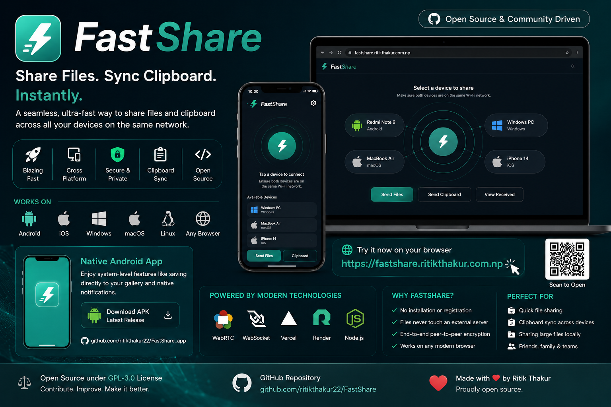

<div align="center">
  

  # 🚀 FastShare
  **A seamless, ultra-fast method to share files and clipboard across devices.**

  [](https://fastshare.ritikthakur.com.np)
  [](https://opensource.org/licenses/GPL-3.0)
</div>

<div align="center">
  <h2>🌟 Introducing FastShare Pro</h2>
  
</div>

---

FastShare is an open-source, ultra-fast, peer-to-peer local file and clipboard sharing application. It enables seamless file transfers across different devices and operating systems without any setup, registration, or cloud dependency. Built with simplicity and speed in mind, FastShare connects devices on the same network instantly.

## 🌟 Live Demo

Visit the live application here: **[https://fastshare.ritikthakur.com.np](https://fastshare.ritikthakur.com.np)**

## 📱 Native Android App

FastShare is now available as a native Android app! Enjoy system-level features like saving directly to your gallery and native notifications.

**[Download the APK here](https://github.com/ritikthakur22/fastshare_app/releases/latest)**

*Source code for the app is available at [ritikthakur22/fastshare_app](https://github.com/ritikthakur22/fastshare_app).*

## 🏗️ Architecture & Hosting

This project is built using a modern, scalable split-deployment architecture for maximum performance and reliability:

- **Frontend (Vercel):** The user interface is completely statically hosted on [Vercel](https://vercel.com). This ensures blazing fast load times globally through Vercel's Edge Network.
- **Backend (Render):** The WebSockets signaling server is hosted on [Render](https://render.com). It acts as an open API for matchmaking, allowing devices to securely discover each other before establishing a direct WebRTC peer-to-peer connection.

<div align="center">
  
  
  
  
</div>

## 🚀 Features

- **Blazing Fast Transfers**: Uses WebRTC for direct device-to-device file transfers.
- **Cross-Platform Compatibility**: Works on Android, iOS, Windows, macOS, and Linux through any modern web browser.
- **Clipboard Syncing**: Automatically log and share your clipboard history with connected devices on your network.
- **No Installation Required**: Run it straight from your browser.
- **Secure & Private**: Files never touch an external server; they are transferred securely via peer-to-peer encryption.

## 📦 Tech Stack & Dependencies

The backend signaling server is powered by Node.js and relies on the following core packages:

| Package | Version | Description |
| :--- | :--- | :--- |
|  | `^4.18.2` | Core web framework for the signaling server |
|  | `^8.16.0` | High-performance WebSocket client & server for Node.js |
| **`express-rate-limit`** | `^7.1.5` | Basic rate-limiting middleware for Express |
| **`ua-parser-js`** | `^1.0.37` | Lightweight device and browser detection |
| **`unique-names-generator`** | `^4.3.0` | Generates random, memorable device names |

*Note: The frontend is built with vanilla HTML, CSS, and JS (No heavy frameworks).*

## 📋 Prerequisites

Before you begin, ensure you have the following installed on your system:
- **[Node.js](https://nodejs.org/)** (v15 or higher)
- **[npm](https://www.npmjs.com/)** (comes pre-bundled with Node.js)
- **[Git](https://git-scm.com/)**

## 🛠 Local Setup & Installation

### 🐧🍎 Linux / macOS
Open your terminal and run:
```bash
# Clone the repository
git clone https://github.com/ritikthakur22/FastShare.git

# Enter the directory
cd FastShare

# Install dependencies
npm install

# Start the application
npm start
```

### 🪟 Windows
Open Command Prompt (`cmd`) or PowerShell and run:
```cmd
:: Clone the repository
git clone https://github.com/ritikthakur22/FastShare.git

:: Enter the directory
cd FastShare

:: Install dependencies
npm install

:: Start the application
npm start
```

Once the server is running, open `http://localhost:3000` in your web browser.

## 💡 How to Use
1. Ensure both devices are connected to the same Wi-Fi network.
2. Open FastShare ([fastshare.ritikthakur.com.np](https://fastshare.ritikthakur.com.np)) on both devices.
3. Tap on a device's icon to send files, or right-click (long-press on mobile) to send a direct message or clipboard text.

## 👏 Credits
FastShare is a modified and rebranded fork of [PairDrop](https://github.com/schlagmichdoch/PairDrop), which itself is a fork of Snapdrop. Huge thanks for building such a robust P2P WebRTC architecture.
